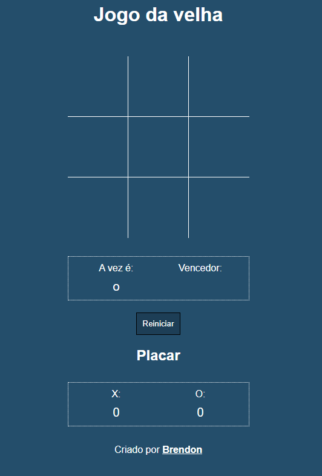
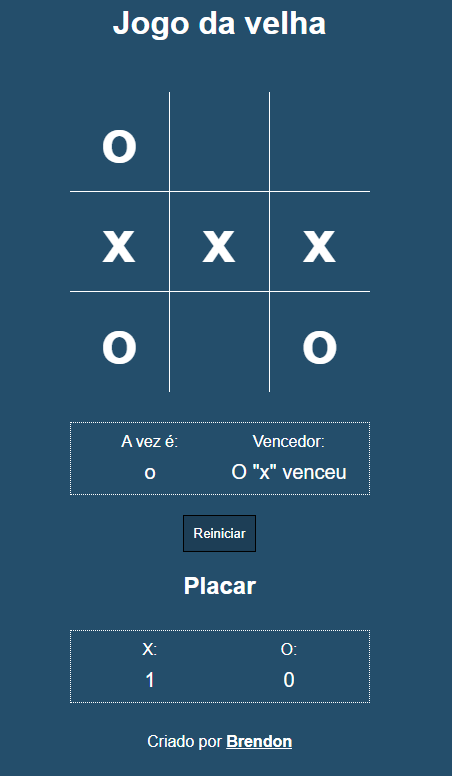
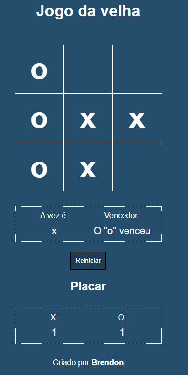

# Jogo da velha

Jogo da velha com placar e também definindo próximo jogador de acordo com o vencedor da última partida. Se não houver vencedor na última partida, irá definir o próximo jogador aleatoriamente

# Imagens do projeto

